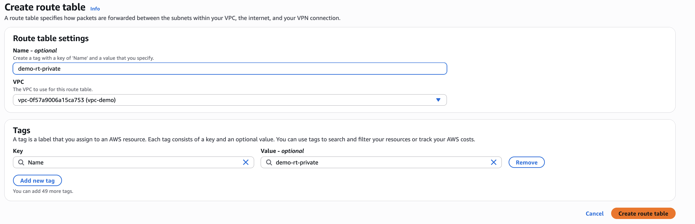
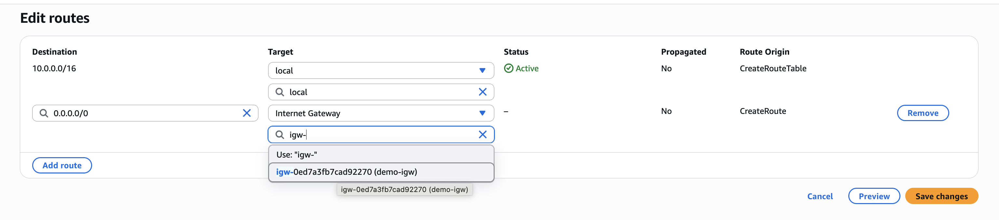

# Клас асаймент 1 - створюємо VPC через Infra As Code

## Розберемося як працює VPC

1. Створюємо VPC перейшовши в відповідних розділ [консолі](https://eu-central-1.console.aws.amazon.com/vpcconsole/home)
2. Обираємо `VPC Only` та CIDR 10.0.0.0/16. Таким чином маємо 65,536 доступних хостів 10.0.0.0 - 10.0.255.255 (<https://www.ipaddressguide.com/cidr> допоможе візуалізувати ваш діапазон адорес). Імʼя на ваш смак

3. Після створення обираємо в списку розділів ліворуч Subnets та тицяємо "Create Subnet". В дропдауні обираємо нашу VPC.
4. Додамо 2 підмережі `demo-private` та `demo-public`. Обирайте Avalability zone A (для простоти прикладу ми все створимо в одній AZ). Їх діапазони мають бути підможиною загального CIDR VPC та не перетинатися. Для публічної я обрав `10.0.0.20/28` (`10.0.0.16 - 10.0.0.31`), для приватної `10.0.1.0/26` (`10.0.1.0 – 10.0.1.0`). Уявимо, що мікросервісів і баз всередині кластера буде до 64х.

5. Насправді зараз обидві підмережі приватні без доступу до інтернет. Оберіть пункт Iternet Gateways в меню ліворуч та тицьніть create. 
6. Потім оберіть його в списку та приєднайте до нашої VPC

7. Налаштуємо правила резолву адрес. Для цього перейдемо [Route Tables](https://eu-central-1.console.aws.amazon.com/vpcconsole/home?region=eu-central-1#RouteTables:) і тицьнемо create.
8. Спершу створимо приватний RT. Обираємо нашу VPC:

Налаштування routes лишаємо за змовчуванням: весь трафік резолвиться локально.
9. Своримо RT для публічної підмережі. Цього разу після креейту треба тицьнути `Edit Routes`

І направити трафік за змовчуванням на IGW:

10. Повернемося до наших підмереж і проасоціюємо їх з намшими новими таблицями маршрутизації (private до private, public до public):

11. Voila! nowsaz tgwe can launch EC2s and other workload in our VPC and connect to public ones (do not forget to press edit in network settings to select our awesome new VPC):

## Хак з заганянням в CFN

1. Зайдіть в [Cloudformation](https://eu-central-1.console.aws.amazon.com/cloudformation/home) та оберіть IaC Generator. Не забувайте перевіряти регіон зверху екрану.

2. Клікніть _"Start New Scan"_. Коли скан завершиться клікніть _"Create Template"_.
3. В пошуку пододавайте ресурси типу VPC, Subnet, Route Table, Internet Gateway і повиділяйте галочками ресурси

4. Клікайте некст до упору і ви побачите CloudForation template того, над чим працювали. Повивчайте його і створіть нову підмурежу вже в CFN. Розгорніть її.
5. Commit it here.
